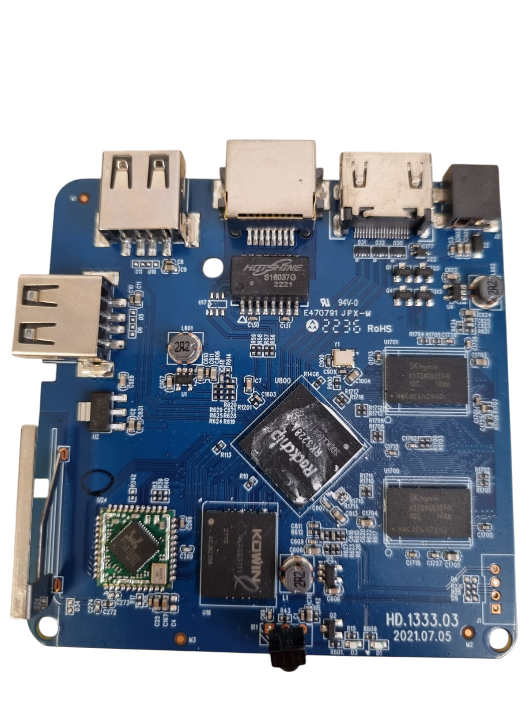
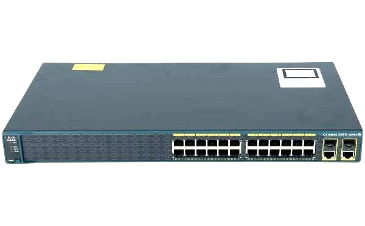
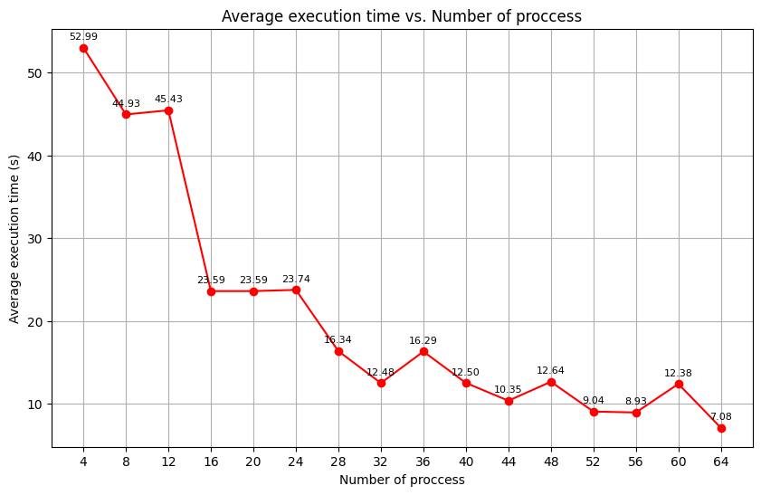
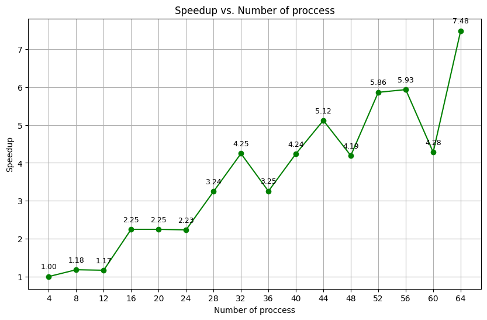
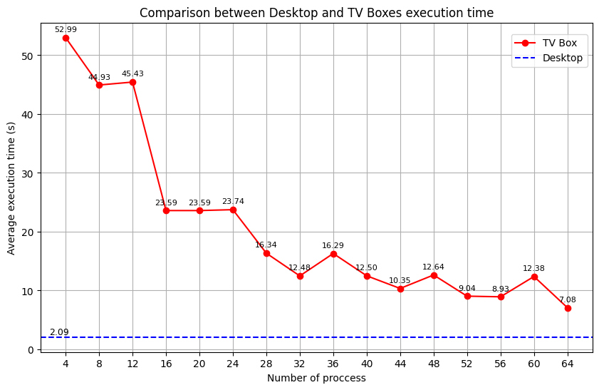

# Case study analysis: Computer cluster with 16 RK3228A TV Boxes

This example aims to show how this program can be used to measure performance gains
by increasing the number of CPUs (process) running the tasks to find the nth prime number

## Hardware used

For this example, we used 16 units of the UniTV S1 TV Box. It has the following specifications:

Component   | Specification
------------|-------------------
RK3228A CPU |       1,2 Ghz
RAM         |       1 GB
Storage     |       8 GB
Network     | Realtek rtl8723ds

And bellow there are some illustrative images:

|Circuit      | Box        |
|-------------|------------|
|  | |

Moreover, a Cisco switch Catalyst 2960 was also used to distribute the data between the units and
make the data trasmission suitable, as it would be very slow by any other mean. Obviously, network
cables and power supply were also needed, but they are not gonna be shown here, as they are very
common pieces of hardware. The following figure illustrates the switch mentioned:



## Script for running the MPI program with increasingly more processes

A simple bash script was written to run the program with the same command-line argument, but with increasingly
more processes (units), so that every execution time could be compared. The script is the folowing:

```bash
#!/bin/bash

PROBLEM_SIZE=10000000

for NP in 4 8 12 16 20 24 28 32 36 40 44 48 52 56 60 64; do
    echo "Running with $NP process"
    mpirun -np $NP --hostfile cluster ./nth_prime $PROBLEM_SIZE
```

## Results and performance gain

In order to increase reliability, the above script was ran 10 times, generating 160 execution times, which were used to make 16 averages. All the values can be checked on the following table:

|   Proccess |   Exec time 1 |   Exec time 2 |   Exec time 3 |   Exec time 4 |   Exec time 5 |   Exec time 6 |   Exec time 7 |   Exec time 8 |   Exec time 9 |   Exec time 10 | Average time  |
|------------:|-------------:|-------------:|-------------:|-------------:|-------------:|-------------:|-------------:|-------------:|-------------:|--------------:|-------------:|
|           4 |        51.78 |        56.23 |        56.65 |        56.37 |        55.71 |        54.53 |        54.09 |        49.19 |        47.71 |         47.64 |         52.99 |
|           8 |        47.62 |        47.53 |        47.52 |        47.64 |        47.47 |        47.5  |        47.33 |        45.83 |        38.93 |         31.97 |         44.93 |
|          12 |        47.74 |        47.91 |        48.16 |        47.95 |        47.83 |        47.89 |        47.95 |        47.73 |        39.75 |         31.39 |         45.43 |
|          16 |        24.46 |        24.39 |        24.39 |        24.4  |        24.47 |        24.46 |        24.46 |        24.49 |        22.9  |         17.48 |         23.59 |
|          20 |        24.51 |        24.66 |        24.58 |        24.63 |        24.58 |        24.56 |        24.55 |        24.53 |        22.53 |         16.74 |         23.59 |
|          24 |        24.49 |        24.78 |        24.55 |        24.53 |        24.56 |        24.47 |        24.64 |        24.54 |        23.92 |         16.92 |         23.74 |
|          28 |        16.81 |        16.88 |        16.9  |        17.15 |        17.08 |        16.85 |        16.99 |        17.18 |        15.71 |         11.83 |         16.34 |
|          32 |        12.98 |        12.93 |        12.94 |        12.95 |        12.97 |        12.91 |        12.94 |        12.59 |        11.86 |          9.77 |         12.48 |
|          36 |        17.03 |        16.91 |        16.79 |        16.78 |        16.79 |        16.74 |        16.79 |        16.76 |        16.44 |         11.91 |         16.29 |
|          40 |        13.07 |        13.03 |        12.98 |        13.08 |        12.95 |        12.97 |        12.95 |        12.95 |        11.54 |          9.48 |         12.50 |
|          44 |        10.63 |        10.85 |        10.77 |        10.73 |        10.61 |        10.63 |        10.66 |        10.64 |         9.67 |          8.33 |         10.35 |
|          48 |        12.99 |        13.01 |        13.05 |        13.01 |        12.95 |        12.99 |        12.97 |        12.96 |        12.94 |          9.58 |         12.64 |
|          52 |         9.11 |         9.11 |         9.22 |         9.67 |         9.78 |         9.39 |         9.11 |         9.44 |         8.11 |          7.49 |          9.04 |
|          56 |         9.2  |         9.12 |         9.17 |         9.13 |         9.15 |         9.2  |         9.14 |         9.14 |         9.14 |          6.95 |          8.93 |
|          60 |        12.9  |        12.91 |        12.92 |        12.99 |        13.03 |        12.97 |        12.89 |        12.92 |        11.52 |          8.76 |         12.38 |
|          64 |         7.23 |         7.29 |         7.23 |         7.25 |         7.23 |         7.26 |         7.27 |         7.26 |         6.63 |          6.17 |          7.08 |

<br>

### Raw results

The averaged results are also shown on the figure bellow, where the execution time on the y axis is related to the number of processing units on the x axis.



<br>

### Performance gain

Besides, the speed ups were calculated using the first 4 processes averaged execution time as reference and pluging into the formula:

<span> Speedup ( S(p) )= <sup>T_ref</sup>/<sub>T(p)</sub></span>

were T_ref is the sequential execution time and T(p) is the parallel execution time.

The results, as the former ones, are shown graphically:



## Comparison to a modern Desktop

For comparison purposes, we also ran the same program on a desktop with the following specifications:

Component         | Specification
------------------|-------------------
intel i3 11th gen |   1,7 - 4,1 Ghz
RAM               |     20 GB
Storage           |  256 GB SSD NVMe

The figure below presents a visual comparison showing that, despite using 16 units, the TV Boxes hardly reach the performance level of the desktop.



It could be estimated that with more units, the TV Boxes might beat the desktop, but unexpected behavior due to overhead may actually delay the execution in some way. The reproduction of this experiment with better-performing TV Boxes is still a subject of testing, though. Benchmarking tests have already shown that, in certain metrics, the CPU of some models reach up to 8 times the load of the UniTV S1 model, however they are not as plentiful as the former one.
